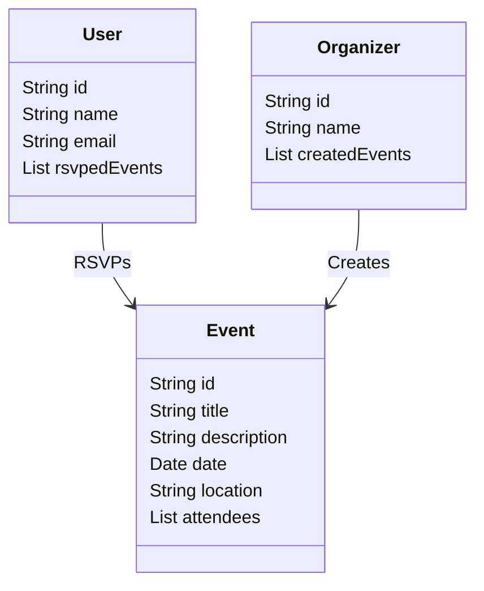

# Campus Event Tracker – Design Document
 
## 1. Introduction
 
- The Campus Event Tracker is a mobile and web application designed to help students discover, RSVP to, and receive reminders for campus events. It centralizes event information from various departments and student organizations, making it easier for students to stay engaged with campus life.
 
- Students often miss events due to scattered announcements or lack of reminders. This application improves campus engagement and communication by providing a single, organized platform for event discovery and participation.
 
**Target Users**
- Students
- Event organizers (student organizations and campus departments)
 
---
 
## 2. Storyboard (Screen Mockups)
 
### Planned Screens
- Login / Signup
- Event Feed (list of upcoming events)
- Event Details (date, time, location, description, RSVP button)
- My Events (RSVPed events and reminders)
- Create Event (for organizers)
- Settings (profile and notification preferences)
 
Mockups will be created using **PowerPoint or Figma** and linked here once finalized.
 
---
 
## 3. Functional Requirements
 
### Requirement 1 – Browse Events
- As a student  
- I want to browse upcoming campus events  
- So that I can decide which ones to attend  
 
**Scenarios**
- Given I am logged in  
- When I open the event feed  
- Then I see a list of upcoming events with key details  
 
- Given there are no upcoming events  
- When I open the event feed  
- Then I see a message stating “No upcoming events available.”
 
---
 
### Requirement 2 – RSVP to Events
- As a student
- I want to RSVP to events
- So that I can receive reminders and updates  
 
**Scenarios**
- Given I am viewing an event  
- When I click the RSVP button  
- Then the event is added to my upcoming events and reminders are enabled  
 
- Given I am not logged in  
- When I attempt to RSVP  
- Then I am prompted to log in before proceeding
 
---
 
### Requirement 3 – Create Events
- As an event organizer  
- I want to create and publish events  
- So that students can discover and attend them  
 
**Scenarios**
- Given I am logged in as an organizer  
- When I submit a completed event creation form  
- Then the event appears in the public event feed  
 
- Given required fields are missing  
- When I submit the event creation form  
- Then validation errors are displayed and the event is not published
 
---
 
## 4. Class Diagram

## 5. Class Diagram Description
- User: Represents a student who browses events and RSVPs.
- Event: Represents a campus event with details such as date, location, and attendees
- Organizer: Represents a user with permission to create and manage events.
 
## 6. JSON Schema
 
{
  "$schema": "http://json-schema.org/draft-07/schema#",
  "title": "CampusEvent",
  "type": "object",
  "properties": {
    "id": { "type": "string" },
    "title": { "type": "string" },
    "description": { "type": "string" },
    "date": { "type": "string", "format": "date-time" },
    "location": { "type": "string" },
    "attendees": {
      "type": "array",
      "items": { "type": "string" }
    }
  },
  "required": ["id", "title", "date", "location"]
}

## 7. Scrum Roles
 
- Product Owner: Christopher Agricola
- Scrum Master: Riddhi Mahajan
- DevOps: Shamak Patel
- Frontend Developer: Rudi Vogel 
- Backend Developer: Riddhi Mahajan
 
## 8. GitHub Project and Milestones
- GitHub Repository: https://github.com/agricocw/Campus-Event-Tracker/tree/main
- GitHub Project Board: https://github.com/users/Shamak10/projects/5/views
 
### Milestone 0: Planning (Week 1-3)
**Goal:** establish team process, repository structure, and project artifacts before development.

**Deliverables**
- Finalize team roles and communication cadence.
- Publish this design document to `README.md`.
- Create GitHub milestones (`Milestone 1`, `Milestone 2`, `Milestone 3`) and related issues.
- Create GitHub project board columns (`Backlog`, `To Do`, `In Progress`, `Review`, `Done`).
- Define initial package/module structure (`ui`, `service`, `dao`, `model`, `test`).

**Ownership**
- Scrum Master/Product Owner: backlog setup, sprint planning, milestone tracking.
- DevOps/GitHub Admin: repository permissions, branch strategy, pull request template.
- UI + Backend members: draft interfaces and identify integration points.

---

### Milestone 1: Define Service Endpoints, Basic UI, Unit Tests (Week 3-6)
**Goal:** deliver a working vertical slice with interface-first design and BDD unit tests.

**Scope**
- Define interfaces for core services and persistence:
  - `EventService`, `AuthService`, `RSVPService`
  - `EventRepository`, `UserRepository`
- Implement stub/mock classes for each interface to enable parallel development.
- Build basic UI screens:
  - Login/Signup
  - Event Feed
  - Event Details with RSVP action
- Implement initial JSON event payload handling.
- Write unit tests for non-UI classes using Given/When/Then format aligned to Section 3 scenarios.

**Definition of Done**
- Students can log in and view events from stubbed or in-memory data.
- Students can RSVP and see RSVP status in "My Events" (basic view acceptable).
- Interface-based tests pass in CI/local build.
- Weekly significant commits and pushes are visible in repository history.

---

### Milestone 2: Persistence and Interface Implementations (Week 7-10)
**Goal:** replace stubs with real implementations and integrate required enterprise features.

**Scope**
- Implement persistence layer behind interfaces using one of:
  - Hibernate/JPA with relational database, or
  - equivalent persistent storage approved by instructor.
- Integrate code review recommendations from Milestone 1.
- Complete organizer flow:
  - Create Event form validation
  - Persisted event publishing to feed
- Improve reminder/notification preference handling in Settings.
- Ensure JSON production/consumption for event APIs.

**Definition of Done**
- CRUD operations for events are persisted and retrievable across sessions.
- Organizer-created events appear in public feed from persistent store.
- Unit/integration tests cover service + dao paths.
- Milestone 1 review feedback is addressed and documented.

---

### Milestone 3: Integration and Final Product Readiness (Week 11-14)
**Goal:** integrate external systems, polish usability, and prepare final presentation.

**Scope**
- Apply Milestone 2 code review feedback.
- Integrate at least one external system:
  - Calendar integration (Google/Outlook ICS export or API), and/or
  - Third-party authentication (OAuth), and/or
  - Cloud storage/service integration.
- Finalize reminders and calendar sync behavior.
- Improve UI/UX polish, accessibility, and responsiveness.
- Prepare and publish final presentation video (Kaltura or YouTube).

**Definition of Done**
- Application demonstrates full flow: discover -> view -> RSVP -> reminder/calendar outcome.
- JSON integration works end-to-end with external/internal APIs.
- Team can demo a marketable, easy-to-use product in final presentation.
- Source is readable, consistently structured, and sufficiently commented.

---

### Sprint Cadence and Commit Policy
- Cadence: 6 two-week sprints (or equivalent) across milestones.
- Each member pushes meaningful code weekly.
- Pull requests require review before merge when possible.
- Scrum Master verifies milestone completion checklists before deadlines.
 
## 9. Weekly Meeting
- Time: Thursday from 10AM-10:30AM
- Platform: Microsoft Teams
- Meeting Link: https://teams.microsoft.com/l/meetup-join/19%3ameeting_OTBmNmExODQtNzUwYy00NjAwLTkzNTAtYWM3ZjhmZmExZDU0%40thread.v2/0?context=%7b%22Tid%22%3a%22f5222e6c-5fc6-48eb-8f03-73db18203b63%22%2c%22Oid%22%3a%222f22b49c-75a0-4097-ad2b-ab7f9fc73f61%22%7d
- Emailed to instructor and team members

